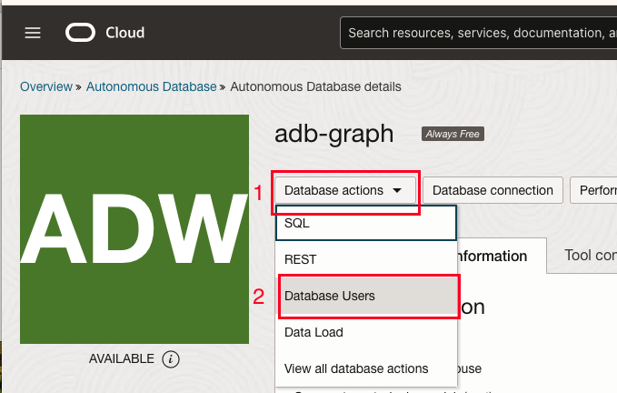
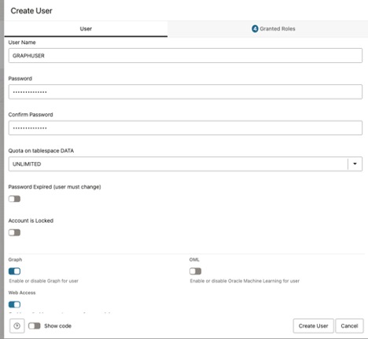
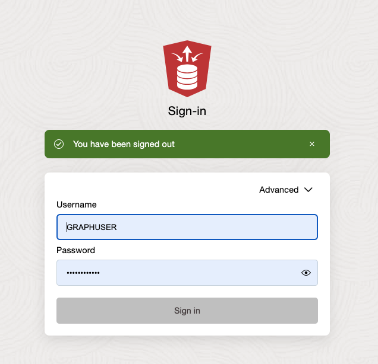
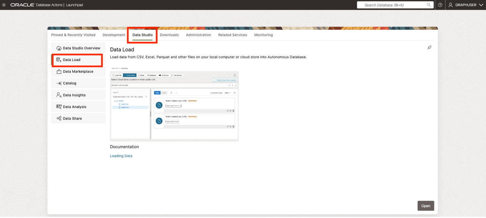
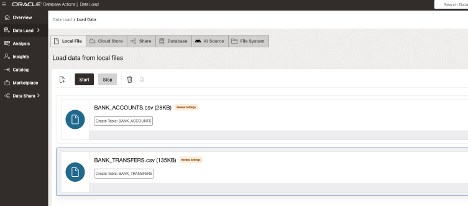
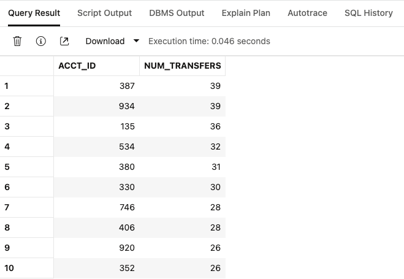
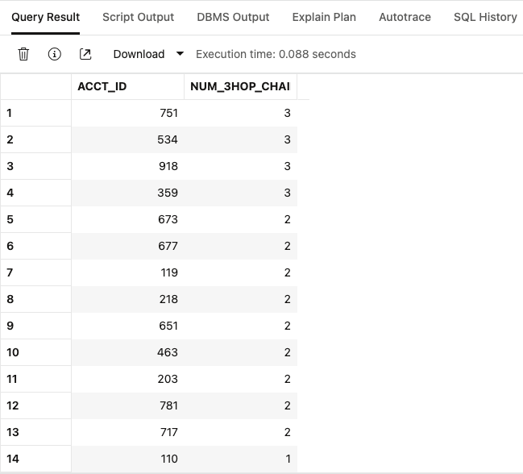
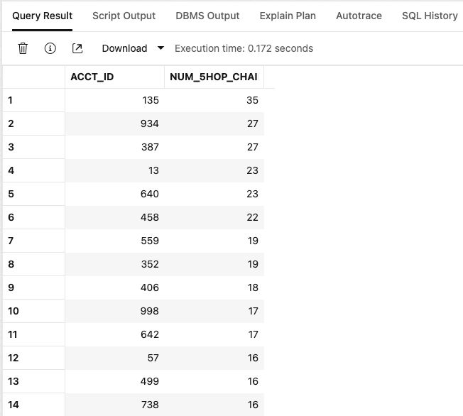
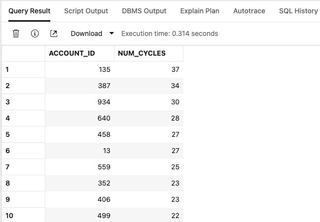

# How do I determine if there are any circular payment chains using property graphs in Oracle Database 23ai?

Duration: 10 minutes

## Answer

Using sample data consisting of two CSV files containing synthetic bank accounts and money transfers, we will determine if there are any circular payment chains, i.e., a chain of money transfers that start and end at the same account after going through 3, 4, or 5 intermediate accounts. Sounds like a too complex problem to solve? Don’t worry – Use of Property Graph makes it simple and easy to analyze connections in data that are seemingly difficult to do.

### **Prerequisites**

* Provision an Autonomous Database instance. For this sprint, I spun up a [free tier instance](https://www.oracle.com/autonomous-database/free-trial/_).
* Download the Bank Graph Dataset contents from [Oracle samples project GitHub](https://github.com/oracle-samples/pgx-samples/tree/master/23c-graph-demos)  into a local directory, e.g., downloads/bankgraphdataset.

### **Create the user GRAPHUSER**

1. Once your Autonomous Database is provisioned, we'll create a new user named GRAPHUSER with the necessary quota and grants. We’ll use Database Actions to launch Database Users.

    

2. Click + Create User.

    

3. Fill out the resulting form as shown in the image below.

    

A video overview of these steps can be found [here](https://youtu.be/RiGEklbA1i0?si=2Hy9wonqbBKTABfp).

### **Connect as GRAPHUSER and load the data**

1. Sign out of Database Actions and sign back in as GRAPHUSER. Enter the password when prompted.

    

2. From Database Actions, navigate to Data Studio -> Data Load.

    

3. Select LOAD DATA.

    

4. Upload the [two files](https://github.com/oracle-samples/pgx-samples/tree/master/23c-graph-demos) you downloaded in the beginning.

    

### **Create a property graph named BANK_GRAPH**

The BANK\_TRANSFERS table has columns named TXN\_ID, SRC\_ACCT\_ID, DST\_ACCT\_ID, DESCRIPTION, and AMOUNT. Each row represents a money transfer from the source (SRC\_ACCT\_ID) to the destination (DST\_ACCT\_ID). This table represents the connections between two accounts and hence becomes an edge in the property graph. The TXN\_ID value identifies an edge and the AMOUNT; optionally, the SRC\_ACCT\_ID and DST\_ACCT\_ID become properties of the edge.
An edge connects vertices. In this instance, the BANK_ACCOUNTS table represents those vertices. The ID column identifies a vertex, while the NAME and BALANCE columns become its properties.
So, in property graph terms, BANK\_ACCOUNTS is a vertex table, and BANK\_TRANSFERS is an edge table.

1. Now, let’s create the property graph. Enter and execute the following statement in SQL while connected as GRAPHUSER.

    ```sql
    <copy>
    CREATE PROPERTY GRAPH BANK_GRAPH
        VERTEX TABLES (
            BANK_ACCOUNTS
            KEY (ID)
            PROPERTIES (ID, Name, Balance)
        )
        EDGE TABLES (
            BANK_TRANSFERS
            KEY (TXN_ID)
            SOURCE KEY (src_acct_id) REFERENCES BANK_ACCOUNTS(ID)
            DESTINATION KEY (dst_acct_id) REFERENCES BANK_ACCOUNTS(ID)
            PROPERTIES (src_acct_id, dst_acct_id, amount)
        );
    </copy>
    ```

See the “SQL DDL Statements for Property Graphs” section in the [Graph Developer’s Guide for Property Graph](https://docs.oracle.com/en/database/oracle/property-graph/24.4/spgdg/sql-ddl-statements-property-graphs.html) for more details.
Next, we’ll query the BANK\_GRAPH to look for circular payment chains.
First, here’s a brief introduction to the GRAPH_TABLE and MATCH clause constructs.

### **Querying property graphs**

GRAPH\_TABLE is an operator that enables you to query the property graph by specifying a graph pattern to look for and then return the results as a set of columns, i.e., a normal SQL table.
The MATCH clause lets you specify the graph patterns. The following example,

```
(src) – [e] -> (dst)
```

consists of two vertex patterns and one edge pattern. The () indicates a vertex, [] an edge, and the arrow -> specifies the edge’s direction.
See the “SQL GRAPH\_TABLE Queries” section in the [Graph Developer’s Guide for Property Graph](https://docs.oracle.com/en/database/oracle/property-graph/24.4/spgdg/sql-graph-queries.html) for more details.
Now, let’s query the BANK\_GRAPH.
First, we look for the top 10 accounts by the number of incoming transfers. Then, we look for the top 10 accounts that are at the center of 2-hop transfers.

```sql
<copy>
REM Find the top 10 accounts by incoming transfers
SELECT acct_id, COUNT(1) AS Num_Transfers
    FROM graph_table ( BANK_GRAPH
        MATCH (src) - [IS BANK_TRANSFERS] -> (dst)
        COLUMNS ( dst.id AS acct_id )
    ) GROUP BY acct_id ORDER BY Num_Transfers DESC
FETCH FIRST 10 ROWS ONLY;
</copy>
```

The result should be:



Next, let’s check for any 3-, 4-, or 5-hop circular payment chains.

```sql
<copy>
REM Check if there are any 3-hop transfers that start and end at the same account
SELECT acct_id, COUNT(1) AS Num_3hop_Chains
    FROM graph_table (BANK_GRAPH
        MATCH (src) - []->{3} (src)
        COLUMNS (src.id AS acct_id)
    ) GROUP BY acct_id ORDER BY Num_3hop_Chains DESC;
</copy>
```



```sql
<copy>
REM Check if there are any 4-hop transfers that start and end at the same account
SELECT acct_id, COUNT(1) AS Num_4hop_Chains
    FROM graph_table (BANK_GRAPH
        MATCH (src) - []->{4} (src)
        COLUMNS (src.id AS acct_id)
    ) GROUP BY acct_id ORDER BY Num_4hop_Chains DESC;
</copy>
```


```sql
<copy>
REM Check if there are any 5-hop transfers that start and end at the same account
SELECT acct_id, COUNT(1) AS Num_5hop_Chains
    FROM graph_table (BANK_GRAPH
        MATCH (src) - []->{5} (src)
        COLUMNS (src.id AS acct_id)
    ) GROUP BY acct_id ORDER BY Num_5hop_Chains DESC;
</copy>
```



Finally, let’s list the top 10 accounts with circular payment chains of between 3 and 5 hops in length.

```sql
<copy>
REM Query by number of 3 to 5 hops cycles in descending order. Show top 10.
SELECT DISTINCT(account_id), COUNT(1) AS Num_Cycles
    FROM graph_table(BANK_GRAPH
        MATCH (v1)-[IS BANK_TRANSFERS]->{3, 5}(v1)
        COLUMNS (v1.id AS account_id)
    ) GROUP BY account_id ORDER BY Num_Cycles DESC FETCH FIRST 10 ROWS ONLY;
</copy>
```



Mission accomplished. Nice job! Take a break and get a coffee! We hope you found this quick introduction useful and got you thinking how you may use Property Graph with your own data to solve problems that you have not been able to solve.

## Learn More

* Try another LiveLab [Explore Operational Property Graphs in Oracle Database 23ai](https://apexapps.oracle.com/pls/apex/r/dbpm/livelabs/view-workshop?wid=3978)
* [Oracle Graph Learning Path](https://blogs.oracle.com/database/post/oracle-graph-learning-path)

## Acknowledgements

* **Author** - Denise Myrick, Senior Product Manager, Oracle Graph
* **Last Updated By/Date** - Denise Myrick, January 2025
